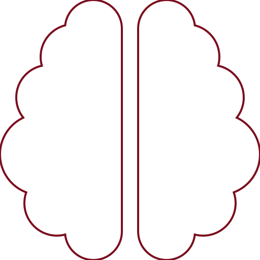
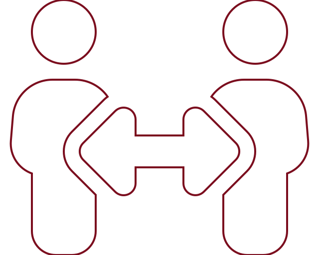

```{css text, echo=FALSE}

/*---------------- Text sizing --------------*/

element.style {
    font-size: 10pt;
}
/*---------------- List Item --------------*/

p, ul, ol {
    font-size: 10pt;
    margin-right: 0%;
    margin-block-end: 0.25em;
    margin-block-start: 0.25em;
    line-height: 16.5px;
}


li {
    font-size: 10pt;
}

/*---------------- Header sizing --------------*/

h1 {
  padding-top: 0px;
  font-size: 16pt;
  padding-bottom: 0px;
  margin-top: -25px;
  margin-bottom: 5px;
}

h2 {
  padding-top: 0px;
  font-size: 12pt;
  padding-bottom: 0px;
  margin-block-start: 0.50px;
  margin-block-end: 0.25px;
}

h3 {
  padding-top: 0px;
  font-size: 12pt;
  padding-bottom: 0px;
  margin-block-start: 0.50px;
  margin-block-end: 0.25px;
}

:root {
  --sidebar-width: 0in;
  --sidebar-background-color: #FFFFFF;
}

.pagedjs_pagebox > .pagedjs_area {
  padding-right: 0.5in;
  padding-left: 0.5in;
}


[data-id="title"] {
  left: 0.05in;
  margin-bottom: 0in;
}

```

```{css columns, echo = FALSE}
/*--- Column Spacing Options ----*/

/*--- 2 Column Divider ----*/
.col-two {
  columns: 2 200px;
  font-size: 2pt;
  padding-left: 20px;
  padding-top: 0px;
  margin: 0em 0;
  text-indent: 0px;
  /* number of columns and width in pixels*/
}

/*--- 3 Column Divider ----*/
.col-three {
  columns: 3 200px;
  font-size: 2pt;
  padding-left: 0px;
  padding-top: 0px;
  margin: 0em 0;
  text-indent: 0px;
  /* number of columns and width in pixels*/
}


/*---------------- Grid Box for containing icons --------------*/
.grid-pink {
  display: grid;
  grid-template-columns: 12.5% 87.5%; /*columns widths*/
  max-height: 40vh;
  padding: 0.25em;
  margin-bottom: 0px;
  color: #7B0D1E;
  background-color: #FFEBEE;
  border: solid 3px #FFEBEE;
}

.grid-red {
  display: grid;
  grid-template-columns: 12.5% 87.5%; /*columns widths*/
  max-height: 40vh;
  padding: 0.25em;
  margin-bottom: 0px;
  color: #FFEBEE;
  background-color: #7B0D1E;
  border: solid 3px #FFEBEE;
}

.grid-red-no-outline {
  display: grid;
  grid-template-columns: 12.5% 87.5%; /*columns widths*/
  max-height: 40vh;
  padding: 0.25em;
  margin-bottom: 0px;
  color: #FFEBEE;
  background-color: #7B0D1E;
  border: solid 3px #7B0D1E;
}

.grid-grey {
  display: grid;
  grid-template-columns: 12.5% 87.5%; /*columns widths*/
  max-height: 40vh;
  padding: 0.25em;
  margin-bottom: 0px;
  color: black;
  background-color: #FFEBEE;
  border: solid 3px #dbceef;
}

.col-1 {
}

.col-2 {
  padding-left: 20px;
}

```

```{css box, echo = FALSE}
/*--- Simple Box Section Dividers ----*/


/*--- Simple Pink Box, no Icon ----*/
div.box {
  padding: 0.25em;
  margin: 0em 0;
  padding-left: 5px;
  padding-top: 0px;
  padding-bottom: 0px;
  background-repeat: no-repeat;
  color: black;
  background-color: #e6ddf4;
  border: solid 3px #FFEBEE;
  text-indent: 0px;
}

/*--- Simple Red Box, no Icon ----*/

div.redbox {
  padding: 0.0em;
  margin: 0em 0;
  padding-left: 5px;
  padding-top: 0px;
  padding-bottom: 0px;
  background-repeat: no-repeat;
  color: #FFEBEE;
  background-color: #7B0D1E;
  border: solid 3px #7B0D1E;
  text-indent: 0px;
}

/*--- Simple Pink Box, no Icon ----*/
div.pinkbox {
  padding: 0.0em;
  margin: 0em 0;
  padding-left: 5px;
  padding-top: 0px;
  padding-bottom: 0px;
  background-repeat: no-repeat;
  color: #7B0D1E;
  background-color: #FFEBEE;
  border: solid 3px #FFEBEE;
  text-indent: 0px;
}

/*--- Simple Quote Box ----*/
div.quote {
  padding-left: 80px;
  padding-top: 0px;
  margin: 0em 0;
  padding-bottom: 0px;
  text-indent: 0px;
}
```

```{r setup, include=FALSE}
knitr::opts_chunk$set(echo = TRUE)
library(tidyverse)
library(pagedown)
#library(pagedreport)
library(ggimage)
library(magick)

#remotes::install_github("rfortherestofus/pagedreport", ref = "main")

# Use this tutorial to make nice boxes
# https://desiree.rbind.io/post/2019/making-tip-boxes-with-bookdown-and-rmarkdown/
```

```{r include = FALSE, eval = FALSE}

#book
#book-reader
#brain
#graduation-cap
#chalkboard-teacher
#school
#balance-scale-right
#handshake
#vote-yea

library(rsvg)
library(fontawesome)

# Get icon of people with arrows
fontawesome::fa_png(
  name = "people-arrows",
    stroke = "#7B0D1E",
    stroke_width = 4,
       fill = "white",  
       file = "fa-people-arrows.png")
# Get icon of person with a plus sign
fontawesome::fa_png(
  name = "user-plus",
       fill = "white",  
       file = "fa-user-plus.png")

# Get icon of comment bubble
fontawesome::fa_png(
  name = "brain",
  stroke = "#7B0D1E",
  stroke_width = 4,
  fill = "white",  
  file = "fa-brain.png")

# Get network
fontawesome::fa_png(
  name = "project-diagram",
  fill = "#7B0D1E",  
  file = "fa-project-diagram.png")

# Get geo
fontawesome::fa_png(
  name = "map-marked",
  fill = "#7B0D1E",  
  file = "fa-map-marked.png")


# Get environmental symbol
fontawesome::fa_png(
  name = "leaf",
  fill = "#7B0D1E",  
  file = "fa-leaf.png")


# Get icon of comment bubble
fontawesome::fa_png(
  name = "comment",
  stroke = "#7B0D1E",
  stroke_width = 4,
  fill = "white",  
  file = "fa-comment.png")
# Get icon of comment buble flipped
image_read("fa-comment.png") %>%
  image_flop() %>%
  image_write("fa-comment.png", format = "png", quality = 100)
# Get icon of vote yes
fontawesome::fa_png(
  name = "vote-yea",
       fill = "white",  
       file = "fa-vote-yea.png")

#image_read("fa-vote-yea.png") %>%
#  image_convert(format = "svg") %>%
#  image_write("fa-vote-yea.svg")

```

Main
================================================================================

**Dr. Timothy Fraser** {#title}
--------------------------------------------------------------------------------

<i style="font-size:14.0pt">Computational Social Scientist</i>

---

# Diversity Statement

<p style="text-indent: 20px">As an educator on environmental politics and data science, I promote diversity in the classroom with 3 main strategies. My teaching practices focus on 1) multimodal teaching to support a neurodiverse student body, 2) building a village-mindset of learning, and 3) boosting representation from women & under-represented minorities in the classroom.</p>

### Embracing Neurodiversity {-}

::: grid-pink

::: col-1

```{r, out.width="100%", echo = FALSE}

```

:::

::: col-2


<p style="text-indent: 20px">My teaching approach centers on making my classes welcoming and accessible to a neurodiverse student body. [“Neurodiversity”](https://www.understood.org/articles/en/neurodiversity-what-you-need-to-know) refers to the idea that brain differences among people are normal, not deficits; given that [nearly 20% of the population is neurodivergent](https://academic.oup.com/bmb/article/135/1/108/5913187) (having ADHD, autism, dyslexia, learning disabilities, or other neurological differences) and [25% have a diagnosed mental health condition](https://www.hopkinsmedicine.org/health/wellness-and-prevention/mental-health-disorder-statistics) (eg. anxiety or depression), this indicates that neurodivergent students are much, much more common in the classroom than traditionally perceived. As an ADHDer myself, I realize many of my students face learning challenges with limited support, and many are undiagnosed. To respond, I design my classes with broad, sweeping improvements to be more accessible to students who think and learn differently.</p>

At Cornell, I am actively involved in the Cornell Neurodivergent Employees group, and I help refer my students to appropriate services at the college. For 2023 Cornell Neurodiversity Week, I spoke as an invited panelist for "Stories of Neurodiversity", as a faculty/staff voice.

:::

:::


### Write it Down {-}

<p style="text-indent: 20px">First, I present all teaching content *written down*, sharing key terms and reading questions using slides with explicitly-written definitions, while students follow along from their computers. First, for students with ADHD, anxiety, depression, and other conditions that impact attention, conveying key information verbally can be quite challenging, because it asks students to never miss what is said verbally and implicitly punishes them when they lose focus because of their differences. Providing written content gives neurodiverse students permission to 'hyperfocus' on one specific part or zone out on another, without costing them the entire lecture, because they can see written down what happened when attention wandered and immediately catch up. For students with dyslexia, dysgraphia, dyscalculia, or non-verbal learning disorder, it gives them more time to read and process words, numbers, or graphs, and the chance to revisit past slides immediately. For my other “neurotypical” students, it is equally helpful, reducing stress to catch every detail and instead allowing them to take meaningful notes and reflections.</p>

### Beyond Visual Learners {-}

<p style="text-indent: 20px">Second, I have adapted my courses to better teach visually-impaired students (students with limited vision). In typical classes, visually-impaired students just receive a note-taker and professors continue teaching as usual on boards too far away to see. Instead, I make all material available in real time through a web browser, custom coding my Workshop's HTML code to allow students to zoom, adjust text sizing, and actively participate. This has the benefit of making my class extremely accessible to students in quarantine during COVID; since they know that their learning will not be impacted, this is an incentive for them to quarantine when necessary to protect their community.</p>

### Multi-modal teaching {-}

<p style="text-indent: 20px">To further address learning disabilities in the classroom, I use a range of teaching modalities *every day.* Each week, I spend just a third of time on lessons (verbal instructions with slides), and focus instead on small group presentations. These ask students to take ownership of material in small groups, respond to *reading questions*, briefly present to classmates, and discuss. I also use tactile learning exercises; one favorite is to teach students about sampling distributions, taking random samples of Skittles and calculating the share that are red.

<p style="text-indent: 20px">I use hands-on activities because students, and especially neurodiverse students, tend to learn better by doing a task multiple times, not hearing or reading about it multiple times. My students have responded enthusiastically to this skill-based teaching style. The majority of class time is spent on hands-on active-learning workshops and labs. Past examples of my hands-on activities include: </p>


- <i class="fa fa-circle fa-2xs"></i> mapping fault trees for a technology and teaching classmates their tree's equation;

- <i class="fa fa-circle fa-2xs"></i> drawing block diagrams for an everyday system and calculating system reliability by hand;

- <i class="fa fa-circle fa-2xs"></i> building miniature stakeholder networks with string and identifying paths vs. cycles;

- <i class="fa fa-circle fa-2xs"></i> 'discover' the central limit theorem by taking small random samples in real time.

- <i class="fa fa-circle fa-2xs"></i> practice interview techniques with each other.

- <i class="fa fa-circle fa-2xs"></i> analyze and visualize a new dataset using coding techniques in R or MATLAB. (Every week involves 1-2 of coding workshops.)

<br>

### Breaking up the pace {-}

<p style="text-indent: 20px">Further, I break up the pace of class using frequent breaks, activities sectioned into 20 minutes, and short guest talks, to help students set-switch between tasks, avoid overwhelm, and allow hyperactive students to move about. Such measures were transformative when I taught a class during the pandemic with several neurodivergent students in 3-hour long class sessions over Zoom. 3 hours is rough for most students, especially those with hyperactivity or learning disabilities. My measures in the classroom help my neurodiverse students and students with disabilities grow their skills and demonstrate their creativity, rather than punishing them with a stringent, unyielding classroom framework.</p>

### It takes a village {-}

::: grid-red

::: col-1

```{r, out.width="90%", fig.align='center', echo = FALSE}

```

:::

::: col-2

<p style="text-indent: 20px">Because I study the value of social capital and social networks, I promote diversity in the classroom by building strong relationships among students, because ‘it takes a village’ to make good scientific study and to learn to code. Women and students from under-represented minorities have often been underserved or excluded in past learning settings; to address this, my students work in small, gender-and-racially-diverse groups every day, building close peer-groups to trust, support each other, and normalize common struggles. I emphasize stories of ordinary students, not 'whiz kids,' arguing that people learn to code *together*, relying on encouragement from mentors, peers, and family. Together, students learn professional skills in methods and data science they never realized they could do alone.</p>

:::

:::

### Representation {-}

<p style="text-indent: 20px">Finally, I make several efforts to increase representation of under-represented minorities in the classroom. In my methods and quantitative techniques classes, I have invited dozens of weekly guest speakers, especially including women (75%) and people of color (33%) to share their experiences using research methods, quantitative techniques, and coding. These speakers, hailing from Northeastern, Johns Hopkins, Dartmouth, Arizona State University, and Google, <text style='color:#7B0D1E'>[provide role models](https://blogs.scientificamerican.com/guest-blog/under-represented-and-underserved-why-minority-role-models-matter-in-stem/)</text>, give students the chance to envision themselves in these fields, break down <text style='color:#7B0D1E'>[gender and racial hierarchies in data science](https://generalassemb.ly/blog/data-science-gender-race-disparity/)</text>, and implicitly tell my students that diversity is the norm, and that they are valued in this field. Similarly, I assign readings from a diverse array of scholars. In class, I require students specifically to use scholars’ full names to humanize these scholars and discuss their experiences and contributions to the field. This helps emphasize the presence of women and people of color in the field.</p>

In my systems engineering courses, I redesigned several assignments to highlight lived experiences of underrepresented stakeholders. For one assignment, my masters students used regression to investigate racial disparities in urban heatwave exposure; for another, they estimated lab stress tests for insulin pumps and interpreted how changing reliability might affect day-to-day usage for a person with Type I diabetes.

### Student Research {-}

<p style="text-indent: 20px">Finally, and most importantly, through my classes, I have invited and worked with 34 undergraduate and masters students on publishable research papers. I specifically aim to support the talent of underrepresented students. 60% of my student coauthors are women and 50% of from under-represented minorities. Our work together has produced 13 peer-reviewed studies published in top journals of environmental politics, and helped my students build hireable quantitative skill sets.</p>

Additionally, in my systems engineering classes, I work step-by-step with 5-to-8 teams in their term projects as they evaluate the reliability of a real-world technology or architect a new system. Through regular group meetings and one-on-ones, I try to support and highlight the voices of underrepresented students, to build more inclusive teams. I have also developed course surveys to evaluate how inclusive student teams are, chaining these to participation grades to reward effective and inclusive teamwork. These techniques have been well received to date.

<p style="text-indent: 20px">Using 1) multimodal, inclusive teaching strategies, 2) building social ties in the classroom, and 3) increasing representation from women and under-represented minorities in the classroom and the curriculum, my teaching methods help students of different backgrounds build skills in data science, methods, and policy analysis, growing their confidence and increasing their long-term professional opportunities.</p>


<br>
<br>
<br>

---

### Student Perspectives {-}

In evaluations, students highlight my active, accessible course design and class structure, and the atmosphere I facilitate. See several excerpts below.

::: box 

<p style="text-indent: 20px"><text style='color:#7B0D1E'>*"He is the most enthusiastic professor I have ever had and he did a great [job] at engaging the class and explaining the concepts clearly and with interesting examples."* (Cornell, Six Sigma)</text></p>

:::

::: box

<p style="text-indent: 20px"><text style='color:#7B0D1E'>*“Professor Fraser does a great job incorporating different teaching styles and activities to keep the class fresh,” citing “labs, group-work, discussion, [and] lecture.”* (Northeastern, Quantitative Techniques)</text></p>
:::


::: box

<p style="text-indent: 20px">Others reported that <text style='color:#7B0D1E'>*‘[he] was always enthusiastic and prepared… [and] structured class time in a way that was really engaging. I really feel like I learned a lot from him.”*(Northeastern, Quantitative Techniques)</text></p>

:::

::: box

<p style="text-indent: 20px">They also indicate that I am flexible and responsive: <text style='color:#7B0D1E'>*“He listens to student responses about what he can do better and communicates well with students.”* (Northeastern, Quantitative Techniques)</text></p>

:::

::: box
<p style="text-indent: 20px">Others said I taught engaging virtual classes, providing <text style='color:#7B0D1E'>“*a really good variety of activities, including breakout rooms, lectures, discussions, guest lecturers, readings, videos, and in-class labs that were helpful in making the class interesting/informative… it was actually really engaging.”* (Northeastern, Research Methods)</text></p>
:::

::: box
<p style="text-indent: 20px"><text style='color:#7B0D1E'>*"I love the way he delivered lectures. His clear instructions made all the projects successful. His approach to R was splendid and I learnt by the fact that he himself was so adept at it. His thinking, teaching and oration are skills I want to strive for. He is so jovial in class and always ecstatic, the energy he got to the class is irreplaceable. I wish all my teachers were like this! If we had a Normal Distribution representing good teachers, he would be on the right end. Way more than 3 sigma away from the mean!"* (Cornell, Six Sigma)</text></p>

:::

::: box

<p style="text-indent: 20px">My evaluations show that students value this atmosphere. One student wrote that I *<text style='color:#7B0D1E'>“did a wonderful job of creating a welcoming and inclusive atmosphere.”* (Northeastern, Quantitative Techniques)</text></p>

:::

::: box

<p style="text-indent: 20px"><text style='color:#7B0D1E'>*"I have never seen a professor more willing to help their students."* (Cornell, Six Sigma)</text></p>

::: 

::: box

<p style="text-indent: 20px"><text style='color:#7B0D1E'>*"Professor Fraser is amazing!!! His lecture is* ***very clear, inspiring, and engaging even for someone without strong background in relating fields. He truly cares about his students*** *and his course strongly increases my enthusiasm in the field of statistics"* (Cornell, Six Sigma)</text></p>.

:::

::: box

<p style="text-indent: 20px"><text style='color:#7B0D1E'>Others valued my attention to accessibility, saying, <text style='color:#7B0D1E'>*“[he] is really mindful of all his students' different situations and that really reflects in his teaching,"</text> and <text style='color:#7B0D1E'>"he was always available to help us better understand the course.”* (Northeastern, Quantitative Techniques)</text></p>
:::

