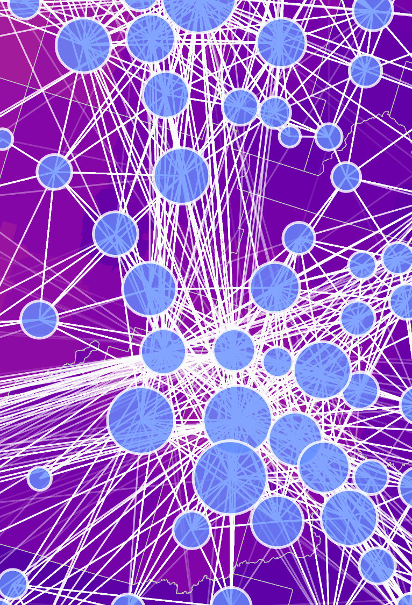
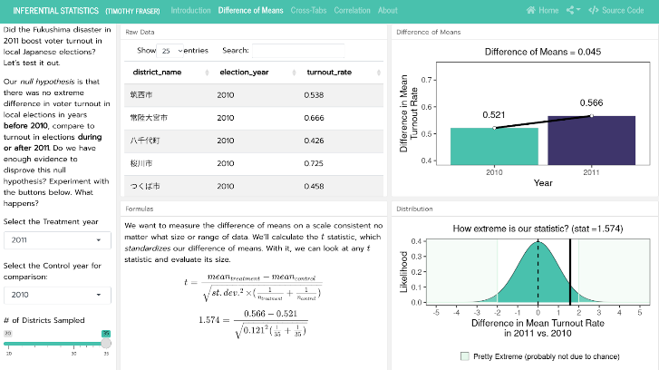
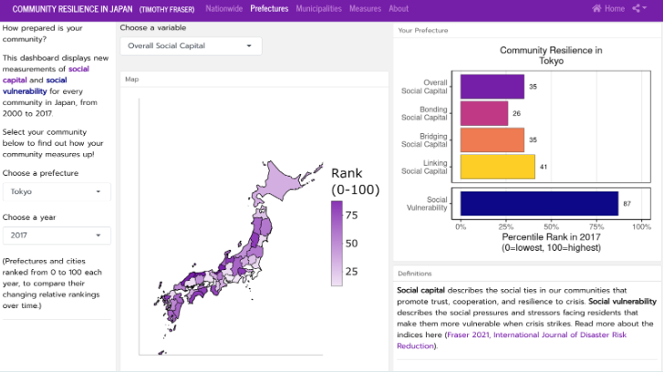
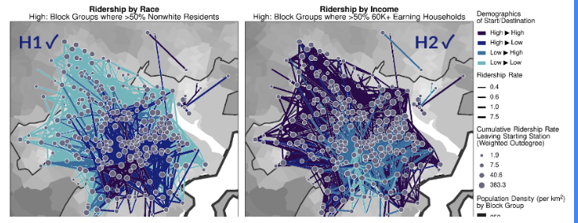
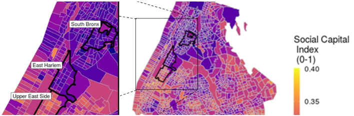
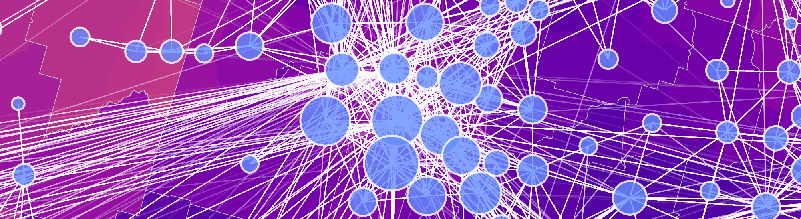

```{r setup, include=FALSE}
library(flexdashboard)
# Install thematic and un-comment for themed static plots (i.e., ggplot2)
# thematic::thematic_rmd()
```

# Home {data-icon="fa-home"}

## Sidebar {.sidebar data-width=300}

```{r headshot, echo = FALSE, out.width="90%", fig.align='center'}

```

<h3>Timothy Fraser, PhD</h4>
<h4>Computational Social Scientist</h4>
<h7>Resilience | Networks |    Mapping | Environmental Policy </h7>
<hr>

<h5>Welcome<h5>

I am a computational social scientist, working as a Postdoc in the Systems Engineering Program at [Cornell University](https://www.systemseng.cornell.edu/se), starting Fall 2022. My research examines how **social infrastructure** and **networks** help communities adapt to crisis.


## Featured Highlights

<h4 style='text-align:center;'>Featured</h3>
<hr>

```{r hero, echo = FALSE, out.width="90%", fig.align='center', fig.cap="Evacuation Network during Hurricane Dorian in Florida"}

```

<hr>

### Dashboards

#### Community Resilience in Japan

```{r, echo = FALSE, out.width="80%", fig.align='center'}

```

How prepared in your city for crisis? Find out here!

#### Inferential Statistics

```{r, echo = FALSE, out.width="80%", fig.align='center'}

```

Test student hypotheses in real time with t-tests, cross-tabs, and correlation tests on real-world data!

## Updates Feed

<h4 style='text-align:center;'>Updates</h3>
<hr>

### PolNet Conference 2022

```{r, echo = FALSE, fig.align = 'left', out.width='90%'}

```
At Political Networks Conference 2022, I presented [my research with undergrads](https://dx.doi.org/10.2139/ssrn.4076776) on Boston's BlueBikes docked bikeshare system, investigating mobility and social stratification!

### New Study in Scientific Reports

```{r, echo = FALSE, fig.align = 'left', out.width='90%'}

```
New [Open-Access study out in Nature Scientific Reports](https://doi.org/10.1038/s41598-022-10275-z)! We developed new method for mapping social capital in every US census tract. Another great collaboration with Courtney Page-Tan & Daniel Aldrich!

### Marshall Fire Response Grant

Our new team-up won $5000 from the Natural Hazards Center at University of Colorado-Boulder. Our team will measure effects of social networks on evacuation after Colorado's Marshall Fire.

### COVID Rapid Grant

```{r, echo = FALSE, fig.align = 'left', out.width='90%'}

```
Our team was funded by the Natural Hazards Center at University of Colorado-Boulder to survey Boston and NYC neighborhoods on how COVID was impacting social ties. Read our [rapid response grant report](https://hazards.colorado.edu/quick-response-report/social-ties-quarantine-policy-and-the-spread-of-covid-19) here!


# About

## Sidebar {.sidebar}

```{r, echo = FALSE, out.width="90%", fig.align='center'}
knitr::include_graphics("images/headshot_cropped.png")
```

<a class="button" href="https://timothyfraser.com/cv">See My CV</a>


### Areas of Expertise

- Social Networks Analysis

- GIS & DataViz

- Climate Change Adaptation

- Health & Pandemics

- Renewable Energy Policy

- Urban Policy

## Text

<h3>About Me</h3>

<hr>

- Timothy Fraser (Tim) is a computational social scientist, studying how social networks help communities adapt to climate change and crisis. Starting Fall 2022, he works as an Ezra Systems Postdoctoral Associate in the [Systems Engineering Program](https://www.systemseng.cornell.edu/se) at Cornell University. 

- He has authored [36 peer-reviewed studies and 5 chapters](https://timothyfraser.com/cv) on urban resilience, disasters, energy, health, and the pandemic in the US and Japan. He also the developer of several statistical packages in R, including the [`simulate`](https://github.com/timothyfraser/simulate) package on Github.

- His recent has been funded by multiple external grants from Fulbright & the Natural Hazards Center, as well as internal grants at Northeastern.
Prior to Cornell, he taught as an Instructor and earned his PhD in [Political Science](https://cssh.northeastern.edu/polisci/) from Northeastern University, from 2017 to 2022. In 2016, he was a Fulbright Fellow at Kyushu University, Japan in 2016.

- Tim teaches research methods and quantitative techniques, using examples from environmental politics, and enjoys leading research with undergraduates and masters students. He also runs tutorials on data science in R. 

<hr>

```{r banner_long, echo = FALSE, out.width="90%", fig.align='center', fig.cap="Evacuation Network during Hurricane Dorian in Florida"}

```


# Research {data-orientation=rows}

## Images

### 

```{r, echo = FALSE, out.width="90%", fig.align='center', fig.cap="Interview in the field with environmental activists in Japan"}
knitr::include_graphics("images/interview.png")
```

### Highlights

- 32 peer-reviewed publications; 5 chapters, 3 pre-prints, & 1 report

- Social Network Analysis, GIS, Modles, Surveys, Fieldwork

- Over 12 coauthors and 19 student coauthors in the US & Japan

- Consulted for UNDP Accelerator Labs and other groups.

### Buttons

<a class="button" style='text-align:center;' href="https://timothyfraser.com/cv">See My CV</a>

<a class="button" href="https://drive.google.com/uc?view=download&id=19lDu2Q7C2nnWvI1XBRuQ82ywKXO_w4oI">Research Statement</a>

<a class="button" href="https://drive.google.com/uc?view=download&id=1VhuKNa_V6DBYIfOtouZ0M1KJ3VZe5WL0">Recent Study</a>

<a class="button" href="https://timfraser.shinyapps.io/community_resilience_in_japan/">Sample Dashboard</a>

## Projects {.tabset}

<h4 style='text-align:center;'>Projects</h3>

### Networks & Resilience

Seawalls or social recovery? The role of policy networks and design in disaster recovery (in Global Environmental Change, 2021)

- This mixed-methods study examines the case of 30 advisory committees across 25 municipalities in Miyagi and Iwate Prefectures in northeast Japan after the 3/11 triple disasters. Drawing on synthetic control experiments, social network analysis, and case studies, we test whether the design of these committees’ policies or the traits of these committee networks improved the recovery trajectories of municipalities. We find that communities highly connected to this network of advisory committees saw better economic recovery than expected, especially when researchers, hyper-connected individuals, or plans for community centers were involved, controlling for disaster damage, infrastructure quality, social vulnerability, governance capacity, emergency services, and social capital. Our results bring with them a number of concrete policy recommendations for disaster managers, local residents, and decision makers.

- with Daniel Aldrich & Andrew Small 

In the hands of a few: Disaster recovery committee networks (in Journal of Environmental Management, 2021)

- When disaster strikes, urban planners often rely on feedback and guidance from committees of officials, residents, and interest groups when crafting reconstruction policy. Focusing on recovery planning committees after Japan's 2011 earthquake, tsunami, and nuclear disasters, we compile and analyze a dataset on committee membership patterns across 39 committees with 657 members. Using descriptive statistics and social network analysis, we examine 1) how community representation through membership varied among committees, and 2) in what ways did committees share members, interlinking members from certain interests groups. This study finds that community representation varies considerably among committees, negatively related to the prevalence of experts, bureaucrats, and business interests. Committee membership overlap occurred heavily along geographic boundaries, bridged by engineers and government officials. Engineers and government bureaucrats also tend to be connected to more members of the committee network than community representatives, giving them prized positions to disseminate ideas about best practices in recovery. This study underscores the importance of diversity and community representation in disaster recovery planning to facilitate equal participation, information access, and policy implementation across communities.

- with Daniel Aldrich, Andrew Small, & Andrew Littlejohn

Rumor has it: The role of social ties and misinformation in evacuation to nearby shelters after disaster (in Climate Risk Management, 2021)

- When crisis strikes, why do some communities utilize evacuation shelters more than others? This mixed methods study draws on a new dataset of almost-daily tallies of evacuees at 660 local shelters following Japan’s 2018 Eastern Iburi Earthquake in Hokkaido to create a large-N time-series cross sectional (TSCS) dataset of local, short-distance evacuation. We pair time-series cross-sectional data models with qualitative comparative analysis (QCA) of nine affected municipalities to examine why some shelters see higher evacuation rates than others. While past studies have used Facebook user data, post-hoc surveys, or ad-hoc roadside interviews to measure evacuation, this study uses meticulously recorded shelter attendance data to draw inferences about evacuation behavior. Controlling for types of shelters, damage levels, infrastructure quality, social vulnerability, governance capacity, and community resources, we find that in affected communities, stronger bridging social ties, especially when aided by linking ties, motivate greater evacuation to shelters. In unaffected communities, stronger bonding and bridging ties encourage potentially unnecessary evacuation, helping spread rumors during blackouts. These results highlight the necessity of clear, transparent communication with the public, and fostering trust in government during crises. 

- with Larissa Morikawa & Daniel Aldrich

Social Network Analysis for Disaster Management Research (Chapter, 2021)

Disaster survivors and scholars alike argue that the presence, dearth, and type of social ties in a community can enable or limit disaster adaptation, response, evacuation, and recovery. After Hurricane Katrina struck New Orleans in 2005, the Vietnamese American community returned and rebuilt more quickly than other damaged areas in the city, relying on the strength of their local co-ethnic and religious neighborhood ties, rather than limited finances or education ( Aldrich, 2012 ). Likewise, after Japan’s 2011 earthquake, tsunami, and nuclear disaster, prefectures with greater bridging ties aid and governmental organizations recovered faster ( Bisri, 2016 a, 2016b; Aldrich, 2019 ). Increasingly, scholars and policymakers see social networks as playing a key role in disaster evacuation, recovery, and resilience. But what kinds of networks can we examine in disaster studies? What kinds of data do we need, what kinds of questions can we answer about these networks, and what tools might students and scholars of disaster studies use to answer these questions? This chapter seeks to make social network analysis methods accessible to students and scholars of disaster policy. Using a network of disaster reconstruction committee members from our own research, we demonstrate different techniques for network visualization, analysis, and statistics. First, we introduce readers to the logic and types of networks they may encounter, drawing from recent examples. Second, we lay out a process for analyzing networks, describing centrality measures, visualization, and statistical models. These techniques predominantly use R. These accessible techniques allow us to identify what kinds of social ties affect recovery and how we can leverage these to improve disaster outcomes.

- with Courtney Page-Tan & Daniel Aldrich

How do disasters affect individuals’ social ties? The impacts of disaster experiences and the perceived risks of disasters on participation in voluntary associations (in International Journal of Disaster Risk Reduction, 2019)

This study focused on the way individuals’ past experiences with disasters and their perceived risks of disasters affect their involvement in voluntary associations, which are important indicators of social capital. Moreover, as recent social capital studies have examined the different types of associations that contribute to the formation of social capital in various ways, for this present study, associations were categorized as civic, reward-based, and social/recreational. The results indicate that both respondents’ experiences with disasters and their perceived risks of disasters tend to increase both the number of associations in which they participate and their degree of involvement. However, experiences related to disasters had a higher impact on the number of associations in which residents participate than on their degree of involvement. Individuals’ experiences with disasters also increased their tendency to join civic associations, whereas their perceived risks of disasters increased partici- pation in both civic and reward-based associations. Social/recreational associations were not significantly af- fected by either disaster experiences or the perceived risks of a disaster.

- with Juheon Lee

A Janus-Faced Resource: Social Capital and Resilience Trade-Offs (Chapter, 2018)

Much research has underscored the critical role played by social capital in building resilience in communities and organizations. In a time of crisis, we know that individuals with more connections embedded in communities that are more cohesive and better connected horizontally and vertically have higher survival rates and better recoveries compared to similar individuals and locations that are less connected. Yet, a more nuanced analysis reveals resilience trade-offs between types of these social connections. This piece investigates how different types of social ties, including bonding, bridging, and linking ties, create different resilience trajectories for neighborhoods and institutions, and how they impart dynamic effects on pre-disaster neighborhood vulnerability.

- with Daniel Aldrich & Courtney Page-Tan

COVID-19 To Go? The Role of Disasters and Evacuation in the COVID-19 Pandemic

- Since the start of the pandemic, some U.S. communities have faced record storms, fires, and floods. Communities have confronted the increased challenge of curbing the spread of COVID-19 amid evacuation orders and short-term displacement that result from hazards. This raises the question of whether disasters, evacuations, and displacements have resulted in aboveaverage infection rates during the COVID-19 pandemic. This study investigates the relationship between disaster damage, sheltering-in-place, evacuation-related mobility, and contagion following Hurricane Zeta in Southeastern Louisiana and The Wildfires in Napa and Sonoma Counties, California, known as the Glass Fire. We draw on data from the county subdivision level and mapped and aggregated tallies of Facebook user movement from the Facebook Data for Good Program. We test the effects of disasters, evacuation, and shelter-in-place behaviors on COVID19 spread using panel data models, matched panel models, and synthetic control experiments. Our findings suggest associations between disaster damage and higher rates of COVID-19 cases. We also find that while sheltering-in-place led to decreases in the spread of COVID-19, evacuation related mobility did not result in our hypothesized surge of cases immediately after the disasters. The findings from this study aim to inform policymakers and scholars about how to better respond to disasters during multi-crisis events.

- with Courtney Page-Tan

### Mapping Resilience

Updates in progress. Coming soon!

### Social Ties & Pandemics

Updates in progress. Coming soon!

### Polarization & Health

Updates in progress. Coming soon!

### Social Ties & Energy Policy

Updates in progress. Coming soon!

### Japanese Environmental Policy

Updates in progress. Coming soon!

### Scholarly Networks


[Connecting Social Capital and Vulnerability: Citation Network Analysis of Disaster Studies](https://drive.google.com/uc?view=download&id=1UUkyc0E-AhIBDTd2PBsv6RJCy54h_2fa) (in Natural Hazard Review, 2021)

- A growing body of disaster scholarship uses qualitative and quantitative methods to illuminate the role of social capital and social networks in recovery and resilience outcomes. However, this approach seems disconnected from older approaches based on broader themes such as vulnerability. Which school of thought is more prominent in disaster social science, and to what degree are these fields interconnected? To address this question, this study used network analysis to visualize citation patterns, schools of thought, and influential authors from 912 articles on disasters. This analysis finds that while all clusters of disaster research deal with some kind of vulnerability—such as age, poverty, race, and gender—only one of six main research clusters engages scholarship on social capital. Despite this gap, the most influential works in the field point to strong synergies between social capital and vulnerability research. This work highlights the role of social capital in helping to understand how vulnerable populations can organize to mitigate disaster outcomes, and using the insights of vulnerability scholars on race and gender to improve social capital scholars’ understanding of bridging and bonding social ties in disaster recovery.

- With Daniel Aldrich & Andrew Small

[Investigating Ties between Energy Policy and Social Equity Research: A Citation Network Analysis](https://drive.google.com/uc?view=download&id=1uqujvjEcuV1KNNcwVkdlCAn-vlxKbXQ9) (in Social Sciences, 2019)

- Japan's energy market has seen the siting and construction of over 2800 new mega-solar power plants since the introduction of the Feed-in Tariff policy in 2012 (Kitamoto, 2017). While scholars have highlighted the potential for community-engaged renewable power development with social benefits for local residents, many major mega-solar projects have instead resulted from industry-led initiatives in locations, largely avoiding community engagement. In this study, we draw from distributive energy justice perspectives to analyze social equity impacts of the mega-solar siting process. We employ qualitative content analysis on 29 survey responses from local officials around Japan's 200 largest mega-solar plants constructed since 2012 and contextualize results through 18 interviews with relevant actors in six case studies. We find that given the existence of the Feed-in Tariff and sufficient solar irradiation, the availability of underutilized land decreases community bargaining power compared to historical power plant siting agreements. This results in primarily land leasing benefits and municipal tax revenue with minimal additional social impacts, such as employment. We outline a model of causation for megasolar social equity impacts, Japanese policy implications, and directions for future quantitative research.

- With Andrew Chapman and Melanie Dennis/Fraser

## Collaborating Researchers

### Coauthors

- Daniel Aldrich, Northeastern University

- Courtney Page-Tan, Embry-Riddle Aeronautical University

- Andrew Chapman, Kyushu University

- Pinar Temocin, Hiroshima University

- Costas Panagopoulos, Northeastern University

- Sameera Nayak, Northeastern University

- Juheon Lee, Midwestern State University

- Melanie Fraser, Cornell University

- Daniel Kim, Northeastern University

### Frequent Student Coauthors

- Larissa Morikawa

- Andrew Small

- Lily Cunningham

- Mary Bancroft

- Eri Lee

- Nikki Naquin

- Dustin Hinkley

- Amos Nasongo

Together, these students and I applied data science techniques and published 7 peer-reviewed studies in top journals in environmental policy, including:

- Global Environmental Change

- Environmental Innovations & Societal Transitions

- Climate Risk Management

- Journal of Environmental Management

- Global Environmental Politics

- and more!


## Third Box

### Public Scholarship & Press

- Reviewed by: Carlos Irwin Oronce and Yusuke Tsugawa. [Bonding and linking social capital are key determinants for successful pandemic policy.](https://doi.org/10.1016/j.socscimed.2021.114376) Social Science & Medicine 287, 114376.

- Quoted in: Marcos Cabello. [Rumors during a natural disaster may facilitate greater evacuation — even when unnecessary](https://academictimes.com/rumors-during-a-natural-disaster-may-facilitate-greater-evacuation-even-when-unnecessary/). The Academic Times, June 8, 2021.

- Quoted in: Sophie Yeo. [When Climate Disaster Strikes, It's Renewable Energy That Keeps The Lights On](https://www.huffingtonpost.co.uk/entry/renewables-clean-energy-climate-disasters_n_5fad67d1c5b6cae94043c56b). Huffington Post, December 1, 2020.

- Timothy Fraser and Daniel P. Aldrich. [The Fukushima Effect at Home: New roles for local actors in Japan's energy policy.](https://www.advancedsciencenews.com/the-fukushima-effect-at-home-new-roles-for-local-actors-in-japans-energy-policy/) Advanced Science News. June 9, 2020

# Teaching

Updates in progress. Coming soon!


