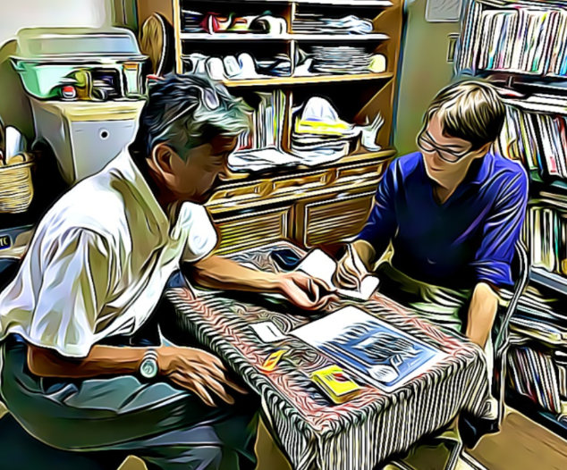

```{r setup, include=FALSE}
library(flexdashboard)
library(bslib)
library(dplyr)
# Install thematic and un-comment for themed static plots (i.e., ggplot2)
# thematic::thematic_rmd()
```

# Home {data-icon="fa-home"}

```{r, echo = FALSE}

card_banner = card_image(file = "images/hero_image_cropped_banner.png")
#  htmltools::span("Evacuation Network during Hurricane Dorian in Florida")

card_bundle = page_sidebar(
  bslib::card(
    
    card_header(
      class = "bg-primary",
      card_title(shiny::icon("user"), "Bio")
    ),
    card_body(
      "Dr. Timothy (Tim) Fraser is an Ezra Systems Research Associate in the Systems Engineering Program at Cornell University. ",
      "He is also Coordinator for the Center for Transportation, Environment, & Community Health (CTECH) at Cornell. ",
      "He is a former Ezra Systems Postdoctoral Associate at Cornell, and has a PhD in Political Science from Northeastern University.",
    ),
    card_body(
      htmltools::span(
        "Tim develops methods & software to help communities combat climate change, using big data analytics, networks, GIS, and AI. ",
        "He has authored",
        htmltools::a(
          "41 peer-reviewed studies, plus dashboards, R packages, software, and chapters",
          href = "https://timothyfraser.com/cv"),
        ", focusing on urban resilience, disasters, energy, health, and the pandemic in the US and Japan. ")),
    
    card_body(
      "His recent has been funded by multiple external grants from Fulbright & the Natural Hazards Center, as well as internal grants from Northeastern University. In 2016, he was a Fulbright Fellow at Kyushu University, Japan. ", 
      htmltools::span("Tim teaches statistics and research methods, using examples from environmental policy, and enjoys leading research with undergraduates and master’s students. He also runs", htmltools::a("tutorials on data science in R.", href = "https://rpubs.com/timothyfraser")
      )
    ),
    
    card_footer(
      htmltools::a(
        "See My CV",
        class="button", href="https://timothyfraser.com/cv")
    )
  ),
  sidebar = bslib::sidebar(
    # Image card
    card_image(file = "images/headshot_cropped.png"),
    card_footer(
      htmltools::h2("Dr. Tim Fraser", class = "text-primary"),
      "Computational Social Scientist"
    ),
    open = "open",
    width = "300px"
  )
)


card_areas = card(
  card_header(card_title("Areas of Expertise"), class = "bg-primary"),
  layout_column_wrap(
    card_body("Political Methodology", class = "bg-primary"),
    card_body("Big Data and APIs", class = "bg-warning"),
    card_body("Dashboards & DataViz", class = "bg-danger"),
    card_body("AI & Automated Reporting", class = "bg-info"),
    card_body("Climate Change & Community Resilience", class = "bg-primary"),
    card_body("Urban Policy & GIS", class = "bg-danger"),
    card_body("Renewable Energy Policy", class = "bg-info"),
    card_body("Network Statistics", class = "bg-warning"),
    card_body("Environmental Policy", class = "bg-primary"),
    card_body("Japanese Politics", class = "bg-info")
  ),
)

card_feature = card(
  
  card_header(
    class = "bg-primary",
    card_title("Featured Work")
  ),
  
  layout_column_wrap(
    
    card(
      card_header(
        htmltools::a("Climate Action in Transportation Dashboard", href = "https://visualizer.cat-apps.com")),
      card_image(file = "images/dashboard_cat.png", width = "100%"),
      card_footer(
        htmltools::span("Visualize your county's emissions from transportation! Powered by ",
                        htmltools::a("Gao Labs @ Cornell", href = "https://gao-labs.github.io/"))
      )
    ),
    
    card(
      card_header(
        htmltools::a("Social Capital Indices Map Every US Census Tract",
                     href = "https://www.nature.com/articles/s41598-022-10275-z")
      ),
      card_image(file = "images/update_nyc.png", width = "100%"),
      card_footer(
        htmltools::a("New Open-Access study out in Nature Scientific Reports",
                     href = "https://doi.org/10.1038/s41598-022-10275-z"))
    ),
    
    card(
      card_header(
        htmltools::a("Community Resilience in Japan Dashboard",
                     href = "https://timfraser.shinyapps.io/community_resilience_in_japan")
      ),
      card_image(file = "images/feature_dashstat.png", width = "100%"),
      card_footer("How prepared in your city for crisis? Find out here!")
    )
  )
)

page(
  theme = bslib::bs_theme(version = 5, preset = "yeti"),
  card_banner,
  card_bundle,
  htmltools::br(),
  card_areas,
  htmltools::br(),
  card_feature
)


```


# Research {data-orientation=rows}

## Images

### 

```{r, echo = FALSE, out.width="90%", fig.align='center', fig.cap="Interview in the field with environmental activists in Japan"}

```

### Highlights

- 42 peer-reviewed publications, 7 chapters, 2 reports, 8 software packages, & more!

- Social Network Analysis, GIS, Panel Statistics, Surveys, Fieldwork

- >25 student coauthors

- Consulted for UNDP Accelerator Labs and other groups.

### Buttons

<a class="button" style='text-align:center;' href="https://timothyfraser.com/cv">See My CV</a>

<a class="button" href="https://drive.google.com/uc?view=download&id=19lDu2Q7C2nnWvI1XBRuQ82ywKXO_w4oI">Research Statement</a>

<a class="button" href="https://drive.google.com/uc?view=download&id=1VhuKNa_V6DBYIfOtouZ0M1KJ3VZe5WL0">Recent Study</a>

<a class="button" href="https://timfraser.shinyapps.io/community_resilience_in_japan/">Sample Dashboard</a>

## Past Projects

### {-}

```{r,echo = FALSE}
card(
  card_header(class = "bg-primary",
    card_title("Projects", class = "h4")
  ),
  layout_column_wrap(fill = TRUE,
    card_body("Networks & Resilience", class = "bg-primary"),
    card_body("Mapping Resilience", class = "bg-warning"),
    card_body("Social Ties & Pandemics", class = "bg-primary"),
    card_body("Polarization & Health", class= "bg-warning"),
    card_body("Social Mobilization & Energy Policy", class = "bg-primary"),
    card_body("Japanese Environmental Policy", class = "bg-warning"),
    card_body("Scholarly Networks", class = "bg-primary")
  )
)

```


## Collaborating Researchers

### Coauthors

- Daniel Aldrich, Northeastern University

- Courtney Page-Tan, Embry-Riddle Aeronautical University

- Andrew Chapman, Kyushu University

- Pinar Temocin, Hiroshima University

- Costas Panagopoulos, Northeastern University

- Sameera Nayak, Northeastern University

- Juheon Lee, Midwestern State University

- Melanie Fraser, Cornell University

- Daniel Kim, Northeastern University

### Frequent Student Coauthors

- Larissa Morikawa

- Andrew Small

- Lily Cunningham

- Mary Bancroft

- Eri Lee

- Nikki Naquin

- Dustin Hinkley

- Amos Nasongo

Together, these students and I applied data science techniques and published 7 peer-reviewed studies in top journals in environmental policy, including:

- Global Environmental Change

- Environmental Innovations & Societal Transitions

- Climate Risk Management

- Journal of Environmental Management

- Global Environmental Politics

- and more!


## Third Box

### Public Scholarship & Press

- Reviewed by: Carlos Irwin Oronce and Yusuke Tsugawa. [Bonding and linking social capital are key determinants for successful pandemic policy.](https://doi.org/10.1016/j.socscimed.2021.114376) Social Science & Medicine 287, 114376.

- Quoted in: Marcos Cabello. [Rumors during a natural disaster may facilitate greater evacuation — even when unnecessary](https://academictimes.com/rumors-during-a-natural-disaster-may-facilitate-greater-evacuation-even-when-unnecessary/). The Academic Times, June 8, 2021.

- Quoted in: Sophie Yeo. [When Climate Disaster Strikes, It's Renewable Energy That Keeps The Lights On](https://www.huffingtonpost.co.uk/entry/renewables-clean-energy-climate-disasters_n_5fad67d1c5b6cae94043c56b). Huffington Post, December 1, 2020.

- Timothy Fraser and Daniel P. Aldrich. [The Fukushima Effect at Home: New roles for local actors in Japan's energy policy.](https://www.advancedsciencenews.com/the-fukushima-effect-at-home-new-roles-for-local-actors-in-japans-energy-policy/) Advanced Science News. June 9, 2020

# Teaching

Updates in progress. Coming soon!


